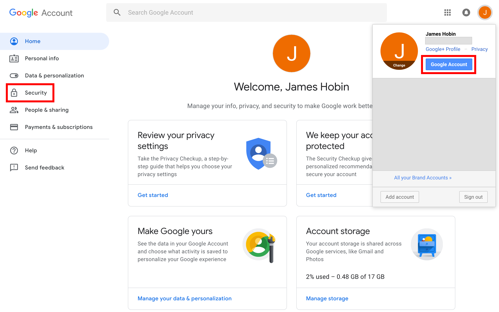
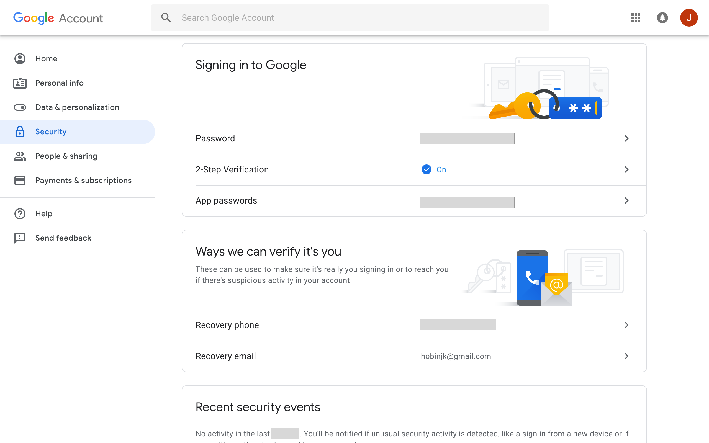
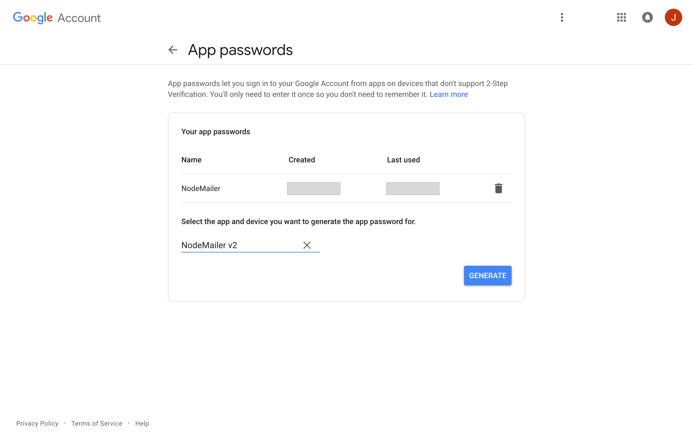
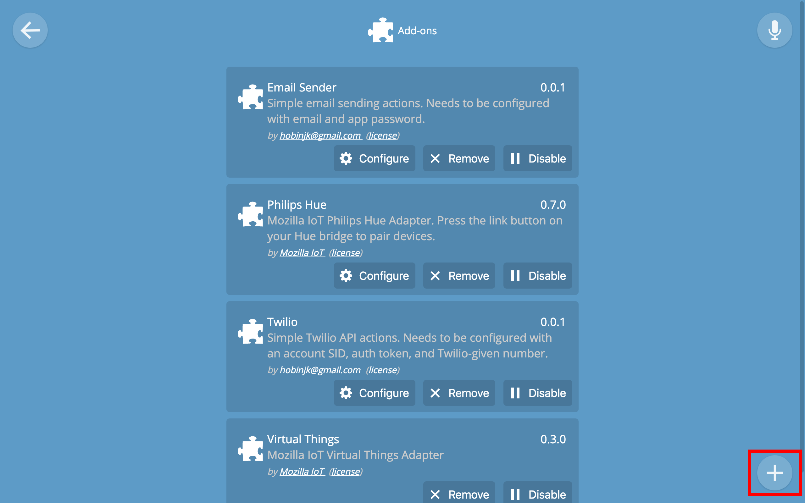
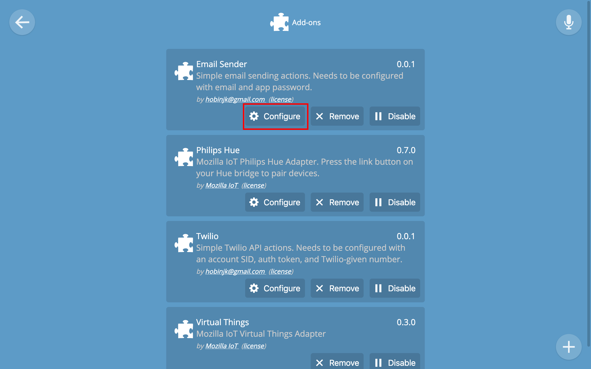
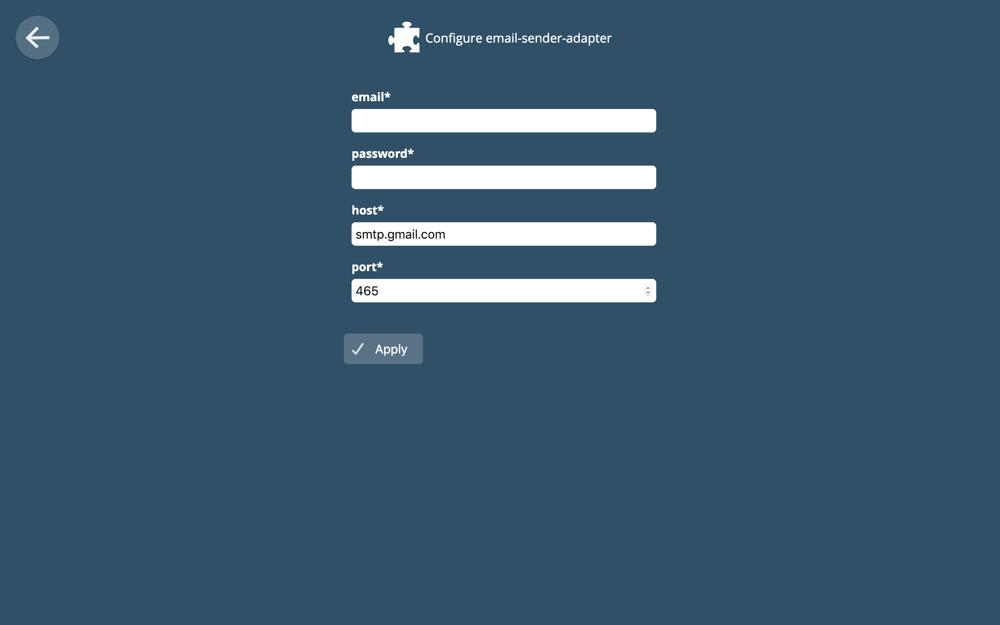
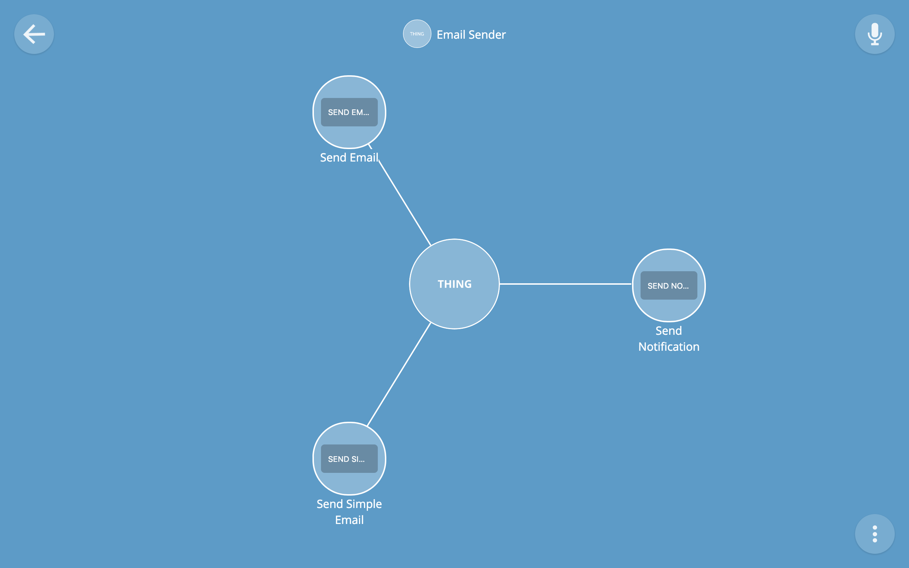
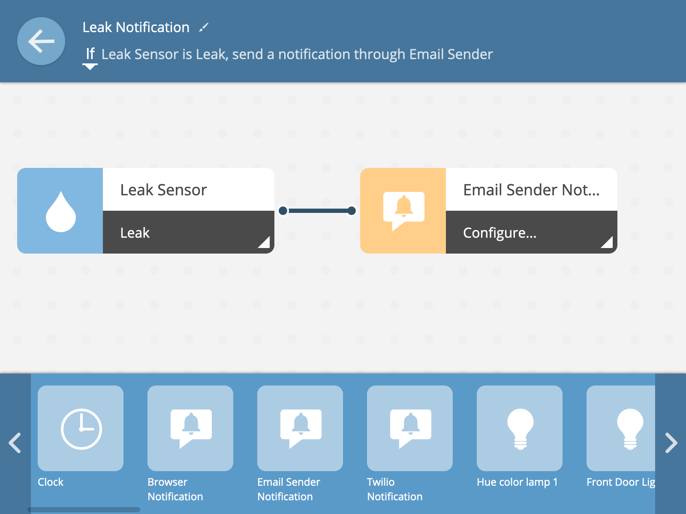
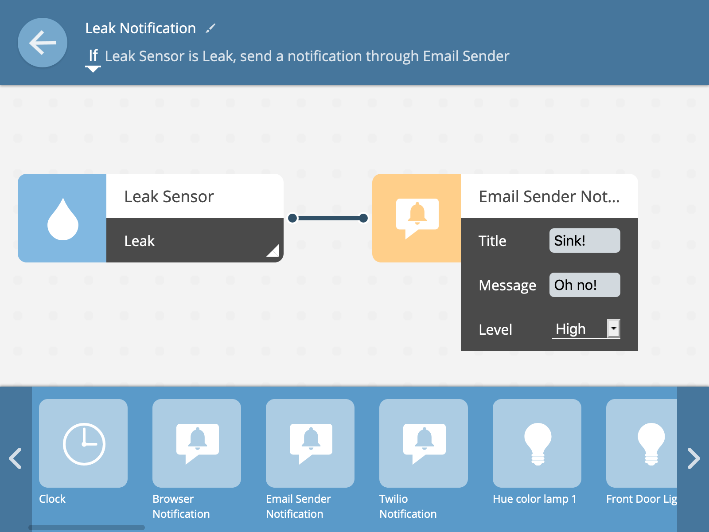

# email-sender-adapter

A simple adapter exposing actions to send emails through the Mozilla WebThings
Gateway.

## Setup

First we need to get an app password from Google's account services to use with
the email sender adapter. If you want to use a non-Google email account, skip
ahead to the Installation and Configuration section and hope that your email
server supports SMTP (or submit a pull request!).

To get an app password from Google, first click your profile icon on any google
property to bring up the helpful Google Account link. Next, go to the Security
section by clicking on it.

In the security section navigate to the App passwords list.

Now we can generate a new app password for the email sender adapter. Name it
something you'll remember and click generate to get the app password that you
should copy down for later.

### Installation and Configuration

Next, we install the email adapter from the addon list. On your gateway, go to
the Settings section and click on Addons. Next, click the plus (+) button and
scroll down to install the email adapter.
With the adapter installed, we can click "Configure" to configure the adapter
with our email address and app password from the Google account page.

Finally, navigate to the main Things page and click the plus button to add the
email sender thing.

We can even drop the Email Sender notification block into rules to send basic
notification emails to ourselves.

